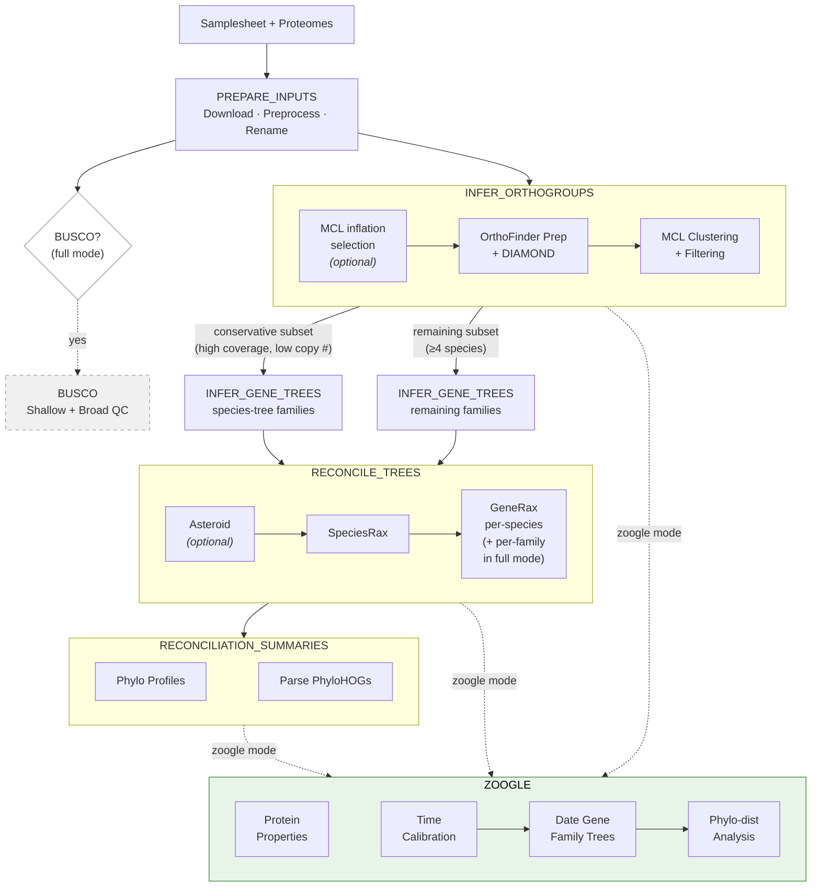
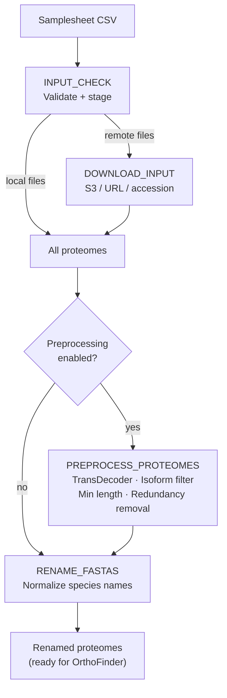
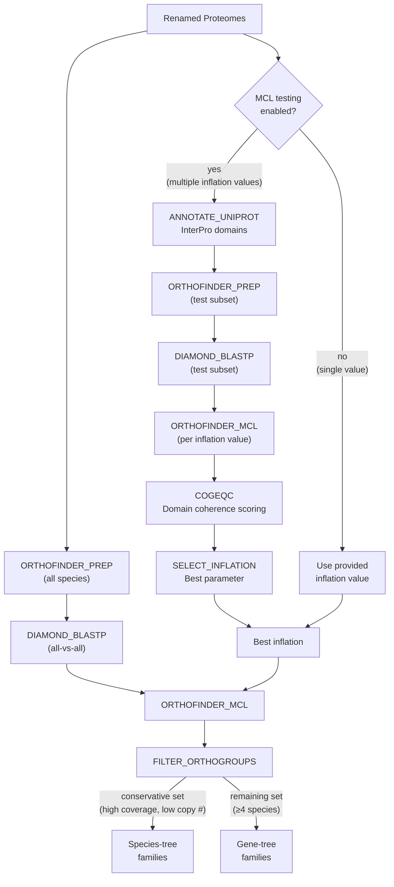
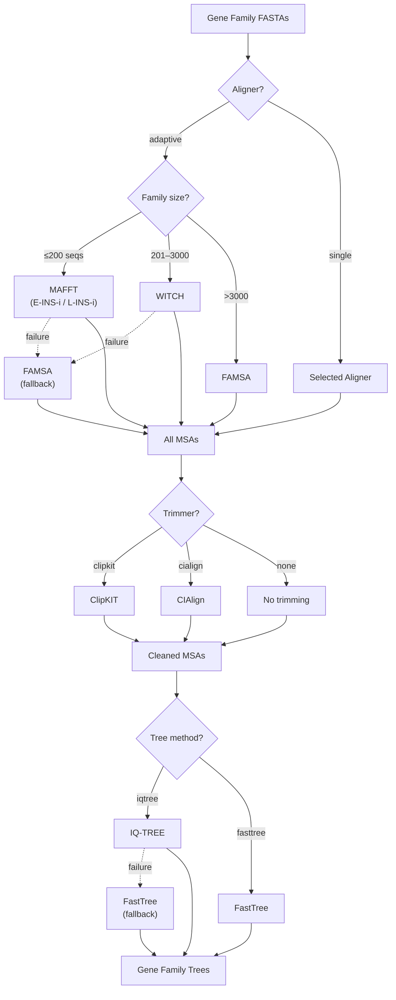
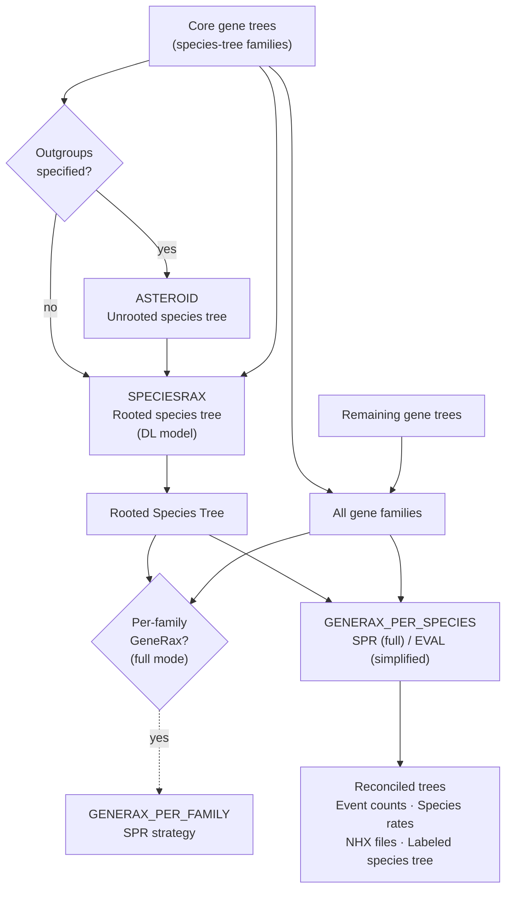
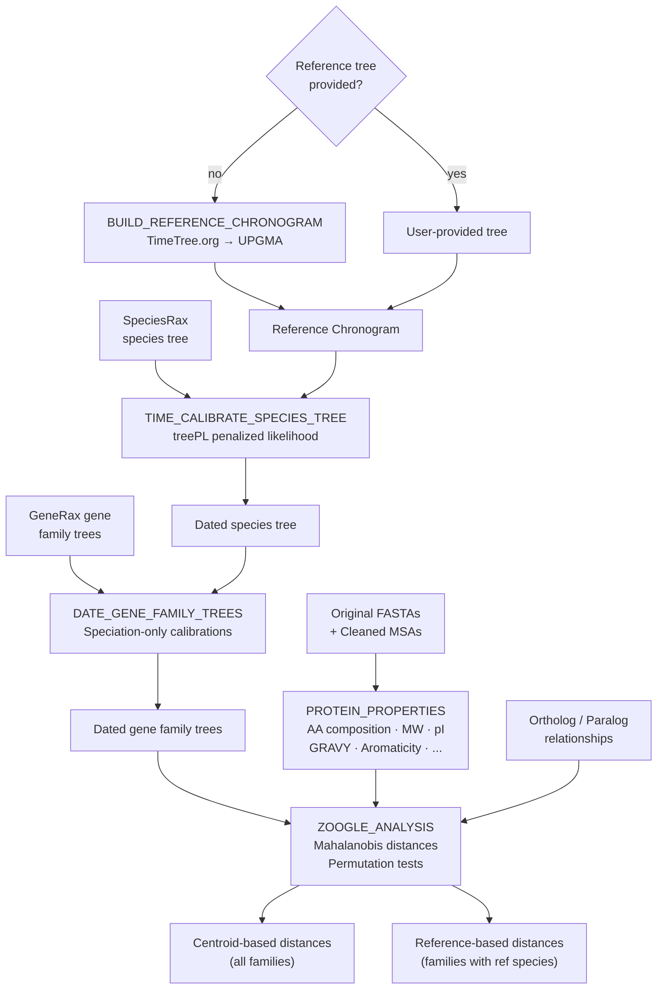

# NovelTree: Highly parallelized phylogenomic inference

**Arcadia-Science/noveltree** is a Nextflow pipeline for phylogenomic inference from whole-proteome amino acid data — automating orthology inference, multiple sequence alignment, gene-family and species tree estimation, and reconciliation-based evolutionary analysis. Input proteomes can be preprocessed using the built-in `--preprocess` flag or filtered externally (see [preprocessing scripts](https://github.com/Arcadia-Science/2023-tsar-noveltree/tree/main/scripts/data-preprocessing)).

`NovelTree` is built using [Nextflow](https://www.nextflow.io), a workflow tool to run tasks across multiple compute infrastructures in a very portable manner. It uses Docker containers making installation trivial and results highly reproducible. The [Nextflow DSL2](https://www.nextflow.io/docs/latest/dsl2.html) implementation of this pipeline uses one container per process which makes it much easier to maintain and update software dependencies.

---

## Quick Start

**NOTE: Unfortunately, at this time NovelTree is not compatible with Apple silicon/ARM architectures (e.g. M1, M2 chips).**

**1.** Install [`Nextflow`](https://www.nextflow.io/docs/latest/getstarted.html#installation) (`>=21.10.3`).

**2.** Install [`Docker`](https://docs.docker.com/engine/installation/).

**3.** Run the pipeline with the minimal test dataset:

```bash
nextflow run . -profile docker,test --outdir results
```

To constrain resource usage (e.g. on a laptop), specify limits:

```bash
nextflow run . -profile docker,test --outdir results --max_cpus 12 --max_memory 16GB
```

Reduce `--max_memory` by ~2 GB below your available memory to leave room for Nextflow overhead.

> **Note:** Pre-built Docker images are pulled automatically. You only need `make docker-all` if you've modified the pipeline code.

**NOTE: The workflow supports both Docker and Singularity profiles.**

---

## Workflow Modes

NovelTree supports three workflow modes to accommodate different use cases and computational constraints:

| Feature                      |   Full   | Simplified | Zoogle   |
| ---------------------------- | :------: | :--------: | :------: |
| BUSCO quality assessment     |    ✓     |     ✗      |    ✗     |
| Default aligner              | Adaptive |  Adaptive  | Adaptive |
| Per-family GeneRax           |    ✓     |     ✗      |    ✗     |
| Per-species GeneRax          |    ✓     |     ✓      |    ✓     |
| GeneRax strategy             |   SPR    |    EVAL    |   EVAL   |
| Phylogenetic profiles        |    ✓     |     ✓      |    ✓     |
| Physicochemical properties   |    ✗     |     ✗      |    ✓     |
| Time-calibrated species tree |    ✗     |     ✗      |    ✓     |
| Phylo-dist analysis          |    ✗     |     ✗      |    ✓     |

_Adaptive mode routes families through MAFFT (≤200 seqs), WITCH (≤3000), and FAMSA (>3000)._

**Which mode should I use?** Use **simplified** mode (the default) for most analyses. Use **full** for smaller datasets (≤30 species) where you want additional analyses (BUSCO, per-family GeneRax). Use **zoogle** when you need physicochemical distance analysis for organism prioritization.

### Full Mode

The complete pipeline with all optional analyses enabled. Best for comprehensive phylogenomic studies where accuracy is prioritized over speed.

```bash
nextflow run . -profile docker --input samplesheet.csv --outdir results
```

### Simplified Mode (Default)

A streamlined variant optimized for large datasets. Skips BUSCO quality assessment, runs only per-species GeneRax with the faster EVAL strategy, and skips per-family GeneRax analysis.

```bash
nextflow run . -profile docker,simplified --input samplesheet.csv --outdir results
```

### Zoogle Mode

Inherits simplified mode settings and adds analyses for organism prioritization: physicochemical protein properties, time calibration of the species tree, and phylogenetically-corrected protein distance analysis. Optionally specify a reference species for pairwise distance analysis, or use `--ref_species none` for centroid-only analysis.

**Recommended** (auto-build reference chronogram from TimeTree.org):

```bash
nextflow run . -profile docker,zoogle \
  --input samplesheet.csv \
  --outdir results \
  --ncbi_email user@example.com \
  --ref_species Genus-species
```

The pipeline queries TimeTree.org for pairwise divergence times among species in your samplesheet and builds a UPGMA reference chronogram automatically.

**Alternative** (provide your own reference tree):

```bash
nextflow run . -profile docker,zoogle \
  --input samplesheet.csv \
  --outdir results \
  --reference_time_tree /path/to/reference_timetree.newick \
  --ref_species Genus-species
```

---

## Running on AWS Batch

NovelTree includes a dedicated AWS Batch profile optimized for cloud-scale analyses:

```bash
nextflow run . \
  -profile awsbatch \
  --awsqueue <your-batch-queue> \
  --awsregion <your-aws-region> \
  -work-dir s3://<your-bucket>/work \
  --outdir s3://<your-bucket>/results \
  --input s3://<your-bucket>/samplesheet.csv
```

The `awsbatch` profile includes optimized executor settings (queue size of 1000 jobs) and automatic report overwriting for seamless pipeline resumption.

**Requirements:**

- AWS Batch compute environment and job queue configured
- Work directory (`-work-dir`) and output directory (`--outdir`) must be S3 paths
- Input samplesheet and proteome files accessible from S3
- Appropriate IAM permissions for Batch and S3 access

See the [Nextflow Tower publication example](docs/usage.md#nextflow-tower-publication-example) in usage.md for cloud-scale configuration tips.

---

## Running with Singularity

NovelTree supports Singularity as an alternative to Docker, which is useful for HPC environments where Docker may not be available:

```bash
nextflow run . -profile singularity --input samplesheet.csv --outdir results
```

Docker images are automatically pulled and converted to Singularity format. Converted images are cached in `${outdir}/singularity_cache` to avoid repeated conversions on subsequent runs.

For detailed Singularity instructions, see the [Singularity documentation](docs/singularity.md).

---

## Building Docker Images

Pre-built Docker images are pulled automatically when running the pipeline. If you've modified the pipeline code or are using a custom fork, rebuild with:

```bash
make docker-all
```

Building R-based images (phylo-dist) may take 15-20 minutes due to package compilation. Images are built for `linux/amd64`.

The `bin/zoogle/` directory contains code vendored from the [2024-organismal-selection](https://github.com/Arcadia-Science/2024-organismal-selection) repository. See `bin/zoogle/README.md` for provenance details.

---

## How it works

1. **Orthology inference** — OrthoFinder normalizes sequence similarity scores and clusters proteins into gene families via MCL. An optional test step selects the best MCL inflation parameter using InterPro domain coherence (COGEQC).
2. **Alignment & trimming** — Adaptive three-tier alignment (MAFFT → WITCH → FAMSA by family size), trimmed with ClipKIT.
3. **Tree inference** — Gene family trees via IQ-TREE (FastTree fallback). Species tree via SpeciesRax (and optionally Asteroid).
4. **Reconciliation** — GeneRax reconciles gene/species trees, estimating duplication and loss rates. Ortholog/paralog relationships and HOGs are parsed from reconciliation output.
5. **Phylogenetic profiles** — Species × gene-family matrices of duplication, loss, and speciation events per species-tree node per gene family.
6. **Zoogle analyses** _(zoogle mode)_ — Physicochemical protein properties, time-calibrated trees, and phylogenetically-corrected protein distances for organism prioritization.

The pipeline distributes tasks in a highly parallel manner across available computational resources, supporting local execution, [AWS Batch](#running-on-aws-batch), and SLURM schedulers ([see Nextflow executor documentation](https://www.nextflow.io/docs/latest/executor.html)).

### Pipeline overview



<details>
<summary><b>Input Preparation</b></summary>



</details>

<details>
<summary><b>Orthogroup Inference</b></summary>



</details>

<details>
<summary><b>Gene Tree Inference</b> (runs once per subset)</summary>



</details>

<details>
<summary><b>Species Tree & Reconciliation</b></summary>



</details>

<details>
<summary><b>Zoogle Analyses</b> (zoogle mode only)</summary>



</details>

---

## Usage

For a detailed description of basic- to advance-usage of the workflow, please see the [`usage.md`](docs/usage.md) file.

## Outputs

For a detailed description of workflow outputs, please see the [`outputs.md`](docs/outputs.md) file.

---

## Credits

NovelTree was originally written by Arcadia Science.

## Feedback, contributions, and reuse

We try to be as open as possible with our work and make all of our code both available and usable.
We love receiving feedback at any level, through comments on our pubs or Twitter and issues or pull requests here on GitHub.
In turn, we routinely provide public feedback on other people’s work by [commenting on preprints](https://sciety.org/lists/f8459240-f79c-4bb2-bb55-b43eae25e4f6), filing issues on repositories when we encounter bugs, and contributing to open-source projects through pull requests and code review.

Anyone is welcome to contribute to our code.
When we publish new versions of pubs, we include a link to the "Contributions" page for the relevant GitHub repo in the Acknowledgements/Contributors section.
If someone’s contribution has a substantial impact on our scientific direction, the biological result of a project, or the functionality of our code, the pub’s point person may add that person as a formal contributor to the pub with "Critical Feedback" specified as their role.

Our policy is that external contributors cannot be byline-level authors on pubs, simply because we need to ensure that our byline authors are accountable for the quality and integrity of our work, and we must be able to enforce quick turnaround times for internal pub review.
We apply this same policy to feedback on the text and other non-code content in pubs.

If you make a substantial contribution, you are welcome to publish it or use it in your own work (in accordance with the license — our pubs are CC BY 4.0 and our code is openly licensed).
We encourage anyone to build upon our efforts.

## Citations

<!-- TODO nf-core: Add citation for pipeline after first release. Uncomment lines below and update Zenodo doi and badge at the top of this file. -->

If you use Arcadia-Science/noveltree for your analysis, please cite it using the following doi: [10.57844/arcadia-z08x-v798](https://doi.org/10.57844/arcadia-z08x-v798)

An extensive list of references for the tools used by the pipeline can be found in the [`CITATIONS.md`](CITATIONS.md) file.

This pipeline uses code and infrastructure developed and maintained by the [nf-core](https://nf-co.re) community, reused here under the [MIT license](https://github.com/nf-core/tools/blob/master/LICENSE).

---

> **The nf-core framework for community-curated bioinformatics pipelines.**
>
> Philip Ewels, Alexander Peltzer, Sven Fillinger, Harshil Patel, Johannes Alneberg, Andreas Wilm, Maxime Ulysse Garcia, Paolo Di Tommaso & Sven Nahnsen.
>
> _Nat Biotechnol._ 2020 Feb 13. doi: [10.1038/s41587-020-0439-x](https://dx.doi.org/10.1038/s41587-020-0439-x).
