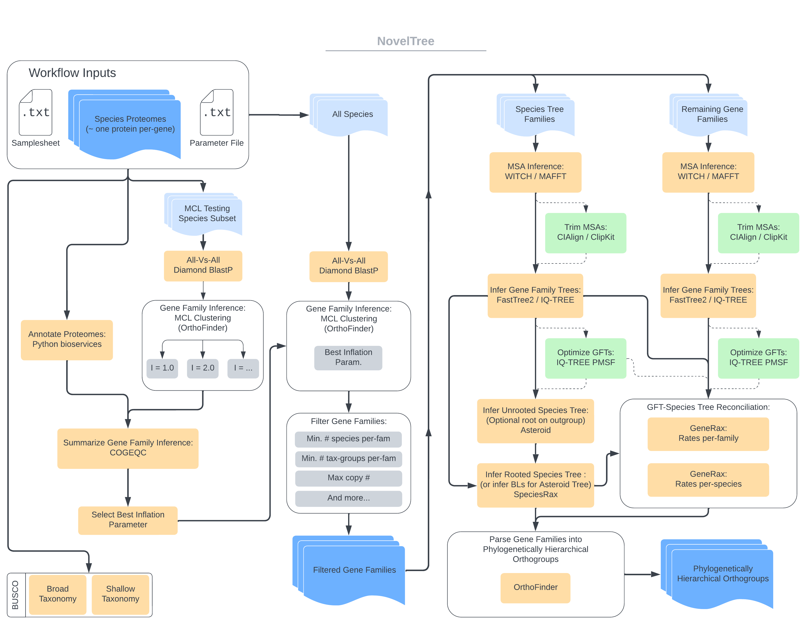

# Run the workflow on your own custom dataset

As a reminder - the pipeline assumes that prior to analysis, input proteomes for each species have been sufficiently filtered such that no additional filtering of species or sequences is required. For a description of such a filtering procedure, see the following [GitHub repository](https://github.com/Arcadia-Science/2023-tsar-noveltree/tree/main/scripts/data-preprocessing). Briefly, these scripts: 1) remove short protein sequences, 2) retain only the longest protein per-gene (in the case of transcriptomes with multiple isoforms), 3) remove redundant protein sequences, and 4) rename protein sequences in accordance to NovelTree's expected format.

## Preparation

**1.** Prepare a samplesheet following the required format:

```
species,file,taxonomy,shallow_db,broad_db,mode,uniprot,mcl_test
Entamoeba_histolytica,Entamoeba_histolytica-test-proteome.fasta,Amoebozoa,NA,eukaryota_odb10,proteins,true,true
```

> #### Description of Columns:
>
> `species`: species name to use.<br/>
> `file`: complete path to fasta file, whether local or remote (e.g. provide complete local file path, or S3 URI/hyperlink to other cloud storage).<br/>
> `taxonomy`: higher-rank taxonomy for each species (e.g. supergroup, class, family, genus). Utility of this parameter depends on the taxonomic scope of each dataset. Used in filtering orthogroups for phylogenetic inference.<br/>
> `shallow_db`: busco lineage dataset for shallow taxonomic scale analysis (e.g. below eukaryota). If NA, will not run.<br/>
> `broad_db`: busco lineage dataset for broad taxonomic scale analysis (e.g. eukaryota). If NA, will not run.<br/>
> `mode`: specification of busco analysis mode.<br/>
> `uniprot`: true/false specification indicating whether the proteome comes from UniProt (i.e. has UniProt protein accessions that `NovelTree` can use to annotate).<br/>
> `mcl_test`: true/false specification of whether this species is to be included in the MCL inflation parameter test-set. These species must have UniProt protein accessions (for COGEQC protein domain score).<br/>

**2.** Create a parameter file that includes all necessary input, output, and parameter specifications: example below.

```
{
  "input": "/full/path/to/samplesheet.csv",
  "outdir": "results",
  "mcl_inflation": "1.0,2.0,3.0",
  "min_ungapped_length": 30,
  "min_num_spp_per_og": 4,
  "min_num_grp_per_og": 1,
  "aligner": "witch",
  "max_copy_num_spp_tree": 5,
  "max_copy_num_gene_trees": 10,
  "download_annots": "none",
  "tree_model": "LG+F+G4",
  "outgroups": "none",
  "msa_trimmer": "none",
  "tree_method": "fasttree"
}
```

> #### Parameter descriptions:
>
> `input`: Complete filepath to input samplesheet. May be locally stored, or remotely stored (again - if remote, provide S3 URI, or hyperlink to other cloud storage).<br/>
> `mcl_inflation`: DEFAULT "1.5,2.0,2.5,3.0". Quoted, comma-separated list of MCL inflation parameters to be tested when clustering proteins into orthogroups with OrthoFinder.<br/>
> `min_ungapped_length`: DEFAULT: 20. The minimum ungapped length of cleaned/trimmed multiple sequence alignments.<br/>
> `min_num_spp_per_og`: DEFAULT: 4. Minimum # of species a gene family must contain for phylogenetic inference.<br/>
> `min_num_grp_per_og`: DEFAULT: 1. Minimum # of 'higher' order taxonomic groups an gene family must contain for phylogenetic inference.<br/>
> `aligner`: DEFAULT: "witch". Method used to infer multiple sequence alignments. Either WITCH (`witch`) or MAFFT (`mafft`).<br/>
> `max_copy_num_spp_tree`: DEFAULT: 5. Maximum # of per-species gene copy number a gene family may contain for species-tree inference.<br/>
> `max_copy_num_gene_trees`: DEFAULT: 10. Maximum # of per-species gene copy number a gene family may contain for gene tree - species tree reconciliation with GeneRax.<br/>
> `min_prop_spp_for_spptree`: DEFAULT: 0.25. Minimum proportion of species a gene family must contain to be used in species tree inference.<br/>
> `download_annots`: DEFAULT: "minimal". Set of annotations to be downloaded. "none" corresponds to a minimal set. See description of parameters for expanded description of options.<br/>
> `tree_model`: DEFAULT: "LG+F+G4". Model of amino acid substition to be used for phylogenetic inference. If using a posterior mean site frequency model (see below), this model will be used to infer an initial guide-tree.<br/>
> `tree_model_pmsf`: OPTIONAL: Posterior mean site frequency model to be used for phylogenetic inference (e.g. "LG+C40+F+G4"). If not specified (i.e. excluded from parameter file), only `tree_model` will be used.<br/>
> `outgroups`: OPTIONAL: A comma separated string of species IDs to be used to manually root Asteroid species tree. If specified, this species tree will have branch lengths estimated with SpeciesRax, and will be used for all GeneRax analyses.<br/>
> `msa_trimmer`: DEFAULT: "none". Method used to clean/trim multiple sequence alignments. The default is "none", which means MSAs are not trimmed. The other options are CLIPKIT (`clipkit`) or CIALIGN (`cialign`).<br/>
> `tree_method`: DEFAULT: "fasttree". Method used to infer trees. Either FASTTREE (`fasttree`) or IQTREE (`iqtree`).<br/>
>
> Alternatively, you can use the test dataset provided by Arcadia Science [here](https://github.com/Arcadia-Science/test-datasets/noveltree).

**3.** Ensure that proteins are named following the following convention: `Species_genus:GeneID`

```
# Example:
>Entamoeba_histolytica:C4M6M9 NGG1-interacting factor 3

# Everything prior to the colon (:) is a constant identifier unique to that species/lineage
# and can be whatever you would like, but must not include a colon.

# Everything that follows the colon is what must be a unique protein/gene identifier
# Additional sequence info may be included following a space.

# If you intend to download annotations for a proteome, the sequence identifier must
# be the UniProt protein accession. NovelTree uses the string that follows the colon
# to extract the uniprot accession and annotate proteins.

# Future versions will include a utility to automate sequence naming, and the ability
# to automatically correspond other standard sequence identifiers (e.g. NCBI RefSeq)
# with UniProt accessions to facilitate this annotation process.
```

**4.** Start running your own analysis! See [here](#parameter-specification) for in-depth parameter description.

```bash
nextflow run . -profile docker -params-file <PARAMS.JSON>
```

---

### **NOTE: Regarding our analysis on Nextflow Tower**

When applying NovelTree to the dataset used in [the associated pub](https://doi.org/10.57844/arcadia-z08x-v798), we launched the workflow via Nextflow Tower to run on AWS Batch and specified additional configurations:

These included:

1. `max_cpus = 5000`: This set the maximum number of available cpus (as spot instances) to all concurrent processes. Effectively the number of CPUs available to our virtual "cloud" computer. This parameter (along with `max_memory` and `max_time` interact with both the run-specific configuration, as well as the runs compute environment.
2. `max_memory = 30000.GB`: The same, but for memory alloted for all concurrent processes.
3. `max_time = 2400.h`: Again, the same, but the maximum time alloted for all concurrent processes.
4. Additionally, we allocated 32 CPUs to the head node to ensure efficient monitoring and submission of jobs.



## The workflow proceeds to conduct the following steps:

1. `INPUT_CHECK`: Proteomes are staged locally (including downloaded from S3 or other cloud storage if necessary)
2. `BUSCO`: Each proteome is summarized using [`BUSCO`](https://busco.ezlab.org/) completeness at both user-specified shallow (e.g. Eukaryota) and taxon-specific scales
3. `PROTEIN_ANNOTATION`: Proteomes for which sequence names include [`UniProt`](https://www.uniprot.org/) protein accessions are annotated using [`UniProt.ws`](https://bioconductor.org/packages/release/bioc/html/UniProt.ws.html)
4. `ORTHOFINDER_PREP`: Proteomes are staged/reformated for analysis with [`OrthoFinder`](https://github.com/davidemms/OrthoFinder)
5. `DIAMOND_BLASTP`: Determine all-v-all (within and among species) protein sequence similarity using [`Diamond`](https://github.com/bbuchfink/diamond) BlastP ultra-sensitive
6. `ORTHOFINDER_MCL`: Cluster [`UniProt`](https://www.uniprot.org/) sequences into orthogroups/gene-families using [`OrthoFinder`](https://github.com/davidemms/OrthoFinder)'s implementation of [`MCL`](http://micans.org/mcl/) clustering using a specified set of inflation scores
7. `COGEQC`: Summarization and quantification of gene family inference performance using a set of summary statistics, including the functional annotation score using [`COGEQC`](https://almeidasilvaf.github.io/cogeqc/index.html) applied to both [`InterPro`](https://ebi.ac.uk/interpro/) domain annotations and [`OMA`](https://omabrowser.org/oma/home/) orthology IDs.
8. `SELECT_INFLATION`: Based on the above summaries, select the (mean) inflation parameter that performs best (e.g. orthogroups are most homogenous in protein domain annotations, penalizing against dispersal of annotations across orthogroups), accounting for diminishing returns with increasing or decreasing parameter values.
9. `ORTHOFINDER_MCL`: Repeat step six (6: MCL clustering into orthogroups) for all species under the optimal inflation parameter
10. `FILTER_ORTHOGROUPS`: Summarize distribution of orthogroups across taxonomic groups and per-species copy number, filtering into a conservative subset for species tree inference, and one for gene-family tree inference.
11. `ALIGN_SEQS`: Infer multiple sequence alignments for each focal gene family with either [`WITCH`](https://github.com/c5shen/WITCH) (default) or [`MAFFT`](https://mafft.cbrc.jp/alignment/software/)
12. `TRIM_SEQS`: OPTIONAL: Trim uninformative/memory-consuming/gappy segments of alignments with either [`CIAlign`](https://github.com/KatyBrown/CIAlign) (defualt) or [`ClipKit`](https://jlsteenwyk.com/ClipKIT/)
13. `INFER_TREES`: Infer gene family trees using either [`FastTree2`](http://www.iqtree.org/) (default) or [`IQ-TREE`](http://www.iqtree.org/)
14. `ASTEROID`: Infer an unrooted species tree using [`Asteroid`](https://github.com/BenoitMorel/Asteroid). If outgroups are specified, this tree will be rooted using these species.
15. `SPECIESRAX`: Infer a rooted species tree, estimating its topology under a model of gene duplication, transfer, and loss using [`SpeciesRax`](https://github.com/BenoitMorel/GeneRax/wiki/SpeciesRax). If outgroups are provided, [`SpeciesRax`] infers branch lengths for the `ASTEROID` tree.
16. `GENERAX_PER_FAMILY`: Reconcile gene family trees with the species tree, inferring rates of gene duplication, transfer and loss using [`GeneRax`](https://github.com/BenoitMorel/GeneRax) under the per-family model (rates are constant across all species/branches)
17. `GENERAX_PER_SPECIES`: Reconcile gene family trees with the species tree, inferring rates of gene duplication, transfer and loss using [`GeneRax`](https://github.com/BenoitMorel/GeneRax) under the per-species model (each species/branch has own rates)
18. `ORTHOFINDER_PHYLOHOGS`: Infer phylogenetically hierarchical orthologs using [`OrthoFinder`](https://github.com/davidemms/OrthoFinder)

# Advanced Usage

The sections below describe advanced usage of `NovelTree`, including per-module parameter specifications and outputs.

## Parameter specification

We have set sensible parameter choices as default for each module, however several modules have parameters that are best-suited to user specification on a per-analysis basis. This section describes, for each module, fixed parameter names, or what default parameters specifications may be. Where necessary, refer to the documentation of each respective software for a more complete list of possible parameter choices.

Certain modules have parameters/flags that are specified in [`conf/modules.config`](conf/modules.config); these are indicated as necessary. It is up to the user to determine whether default specifications are sensible for any given dataset/analysis. Custom specifications may be made following the same convention (example below, [documented here](https://nf-co.re/developers/modules#general)) as used for these modules.

```
process {
    withName: 'MAFFT' {
        ext.args = [
            '--localpair',
            '--maxiterate 1000',
            '--anysymbol'
        ].join(' ')
    }
}
```

### Module: select each to follow links to corresponding module file.

#### 1. [`BUSCO`](modules/nf-core-modified/busco.nf):

- `config_file`: Optional config file used used by BUSCO.
- `busco_lineages_path`: Optional path to locally stored BUSCO lineage datasets
- [BUSCO documentation](https://busco.ezlab.org/busco_userguide.html)

#### 2. [`ANNOTATE_UNIPROT`](modules/local/annotate_uniprot.nf):

- `download_annots`: Specified in the parameter file.
- **Parameter may be specified as one of three things:**
  i. `all` - download all 16 possible sets of protein annotations from UniProt where possible.
  ii. `minimal` - download only the minimum necessary annotations that are used by cogeqc for gene family inference quality assessments.
  iii. A quoted, comma separated string of select numbers 1-16: example `"1,2,4,7,10"`. Numbers correspond to the index of annotations the user would like to download. See below for the correspondance and brief description of each annotation. For indices 4-16 (in particular) see https://www.uniprot.org/help/return_fields.
  ```
  1. Minimal set of protein annotations/metadata required for COGEQC gene family inference:
     protein external IDs for InterPro, OMA
  2. General protein metadata: protein name, length, mass, information from mass spec
     experiments, host organisms (for viral proteins), which organelle (if relevant)
     encoding the protein, any AA variants due to RNA editing
  3. Gene ontologies - biological process, cellular component, molecular function,
     ontology ID
  4. Function: Multiple annotations pertaining to the molecular function of the protein
  5. Interactions
  6. Protein-protein interactions (external database reference IDs)
  7. Pathology & biotech
  8. Subcellular location
  9. Post-translation modification (PTM) / processsing
  10. PTM databases
  11. Protein family & domains
  12. Protein family/group databases
  13. Sequence databases
  14. 3D structure databases
  15. Enzyme and pathway databases
  16. Phylogenomic databases
  ```

#### 3. [`DIAMOND_BLASTP`](modules/nf-core-modified/diamond_blastp.nf):

- `--ultra-sensitive`: Specified in [`conf/modules.config`](conf/modules.config). By default, sequence similarity is assessed using the most sensitive (albeit slowest) method.
- [Diamond documentation](https://github.com/bbuchfink/diamond/wiki)

#### 4. [`ORTHOFINDER_MCL`](modules/local/orthofinder_mcl.nf):

- `mcl_inflation`: Comma-separated list of inflation parameter values to be used in testing. Currently testing is mandatory - optional use is a work in progress.
- [OrthoFinder2 documentation](https://github.com/davidemms/OrthoFinder)

#### 5. [`FILTER_ORTHOGROUPS`](modules/local/filter_orthogroups.nf):

- Parameters specified in parameter json file or via commandline when running workflow.
- `min_num_seq_per_og`: Minimum number of sequences a gene family must contain for phylogenetic inference.
- `min_prop_spp_for_spptree`: Minimum \% of species for inclusion in species tree inference.
- `min_num_spp_per_og`: Minimum \# of species a gene family must contain for phylogenetic inference.
- `min_num_grp_per_og`: Minimum \# of 'higher' order taxonomic groups a gene family must contain for phylogenetic inference.
- `max_copy_num_filt1`: Maximum \# of per-species gene copy number a gene family may contain for species-tree inference.
- `max_copy_num_filt2`: Maximum \# of per-species gene copy number a gene family may contain for gene tree - species tree reconciliation with GeneRax.

#### 6. `ALIGN_SEQS`

### [`MAFFT`](modules/nf-core-modified/mafft.nf):

- Parameters specified in [`conf/modules.config`](conf/modules.config). See MAFFT documentation for detailed description of options.
- `--localpair --maxiterate 1000 --anysymbol`: Runs MAFFT L-INS-i. Iterative refinement method incorporating local pairwise alignment information. Highly accurate, but slower.
- [MAFFT documentation](https://mafft.cbrc.jp/alignment/software/)

### [`WITCH`](modules/nf-core-modified/witch.nf):

- Parameters specified in [`conf/modules.config`](conf/modules.config).
- See [WITCH documentation](https://github.com/c5shen/WITCH) for detailed description of options.

#### 7. `TRIM_SEQS

### [`CLIPKIT`](modules/local/clipkit.nf):

- Defaults used. Custom parameters should be specified in [`conf/modules.config`](conf/modules.config).
- [ClipKIT documentation](https://jlsteenwyk.com/ClipKIT/)

### [`CIALIGN`](modules/local/cialign.nf):

- Custom parameters specified in [`conf/modules.config`](conf/modules.config).
- See [CIALIGN documentation](https://github.com/KatyBrown/CIAlign) for detailed description of options.
- `--crop_divergent_min_prop_ident=0.25 --crop_divergent_min_prop_nongap=0.25 --crop_ends --remove_insertions --insertion_min_size=5 --insertion_max_size=200 --remove_divergent --remove_divergent_minperc=0.15`

#### 8. INFER_TREES

### [`FASTTREE`](modules/nf-core-modified/fasttree.nf):

- Custom parameters specified in [`conf/modules.config`](conf/modules.config).
- See [FastTree2 documentation](http://www.microbesonline.org/fasttree/) for detailed description of options.
- `-lg -cat 20 -gamma -sprlength 50 -mlacc 3 -topm 2 -bionj`

### [`IQTREE`](modules/nf-core-modified/iqtree.nf):

- `tree_model`: Model of amino acid substition to be used for phylogenetic inference. If using a posterior mean site frequency model (see below), this model will be used to infer an initial guide-tree. Specified in parameter-file.
- `tree_model_pmsf`: OPTIONAL posterior mean site frequency model to be used for phylogenetic inference (e.g. "LG+C40+F+G4"). If not specified (i.e. excluded from parameter file), only `tree_model` will be used. Specified in parameter-file.
- All other custom parameters should be specified in [`conf/modules.config`](conf/modules.config).
- [IQ-TREE documentation](http://www.iqtree.org/)

#### 9. [`ASTEROID`](modules/local/asteroid.nf):

- Parameters should be specified in [`conf/modules.config`](conf/modules.config).
- `--random-starting-trees 10`: Number of random starting trees used in species tree inference.
- [Asteroid documentation](https://github.com/BenoitMorel/Asteroid)

#### 10. [`SPECIESRAX`](modules/local/speciesrax.nf):

##### **PLEASE** read the [SpeciesRax documentation](https://github.com/BenoitMorel/GeneRax/wiki/GeneRax) to GeneRax and SpeciesRax for a more detailed explanation, both of these options as well as other possible parameter specifications.

- The following parameters are specified within the [SpeciesRax module file](modules/local/speciesrax.nf)
- `--strategy SKIP --si-estimate-bl --per-species-rates`

- The following parameters are specified in [`conf/modules.config`](conf/modules.config).
- `--rec-model UndatedDTL --si-strategy SKIP --si-quartet-support`

#### 11. [`GENERAX_PER_FAMILY`](modules/local/generax_per_family.nf):

- The following parameters are specified within the [GeneRax per-family module file](modules/local/generax_per_family.nf)
- `--prune-species-tree --reconciliation-samples 100`

- The following parameters are specified in [`conf/modules.config`](conf/modules.config).
- `--rec-model UndatedDTL --strategy SPR`

- [GeneRax documentation](https://github.com/BenoitMorel/GeneRax/wiki/GeneRax)

#### 12. [`GENERAX_PER_SPECIES`](modules/local/generax_per_species.nf):

- The following parameters are specified within the [GeneRax per-species module file](modules/local/generax_per_species.nf)
- `--prune-species-tree --reconciliation-samples 100 --per-species-rates`

- The following parameters are specified in [`conf/modules.config`](conf/modules.config).
- `--rec-model UndatedDTL --strategy SPR`

- [GeneRax documentation](https://github.com/BenoitMorel/GeneRax/wiki/GeneRax)
